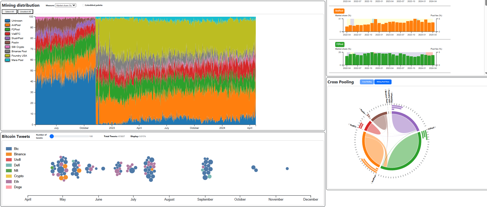

# Bitcoin Mining Dashboard

Bitcoin Mining Dashboard is an interactive data visualization project that explores trends in the Bitcoin mining ecosystem. It combines datasets on mining pools, market activity, transaction volume, and public sentiment to present key patterns through clear charts and timelines. The dashboard helps users quickly understand how mining behavior changes over time and how it relates to broader Bitcoin network and market movements.

